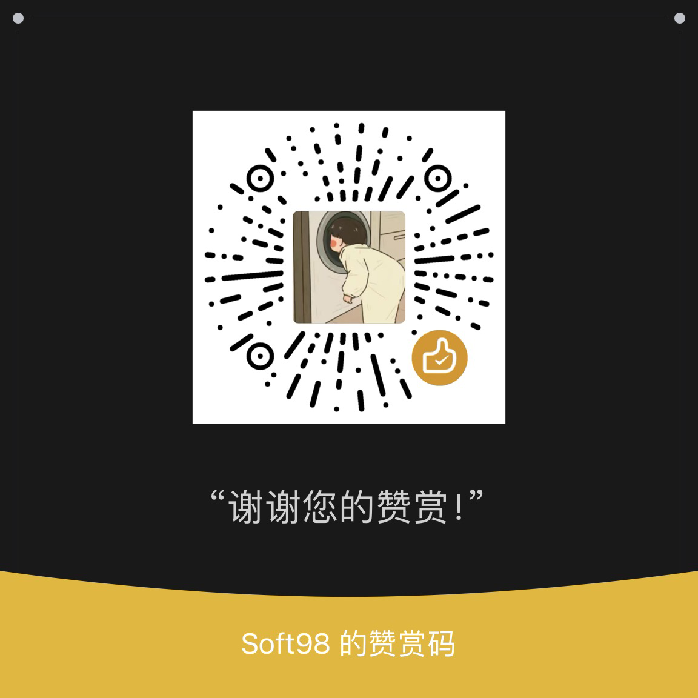

# AliDown

阿里云盘分享链接下载工具

## 文件概述

```
.
├── LICENSE             开源许可
├── README.md           README
├── alidown2.py         AliDown 客户端
├── mgt.py              AliDown 管理端
├── requirements.txt    依赖列表
├── secret
│   └── config.json     服务端配置文件
└── server.py           AliDown 服务端
```

## 使用说明

### AliDown 客户端使用说明

```
usage: alidown2.py [-h] [-u URL] [-s SID] [-sp SPWD] [-f FID] [-q QUERY] [--select] [--folder FOLDER] [-v] [-t TARGET] [-p PWD] [--code CODE] [-ti TINDEX] [--proxy PROXY]
                   [-n N] [--chunk CHUNK] [-ct CHUNKTYPE] [--retry RETRY] [--timeout TIMEOUT]

阿里云盘分享链接下载工具

options:
  -h, --help            show this help message and exit

share_link_config:
  分享链接相关配置

  -u URL, --url URL     需要下载的分享链接
  -s SID, --sid SID     需要下载的share_id
  -sp SPWD, --spwd SPWD
                        需要下载的分享链接密码
  -f FID, --fid FID     需要下载的file_id
  -q QUERY, --query QUERY
                        搜索分享链接中的文件
  --select              选择下载文件

client_config:
  客户端相关配置

  --folder FOLDER       保存文件的位置
  -v                    查看相关信息

server_config:
  服务器相关配置

  -t TARGET, --target TARGET
                        切换服务器地址，自动获取配置信息
  -p PWD, --pwd PWD     获取远程配置信息时，配置链接密码，需要结合-t参数使用
  --code CODE           获取远程配置信息时，配置内测码，需要结合-t参数使用
  -ti TINDEX, --tindex TINDEX
                        切换目标地址
  --proxy PROXY         设置代理, 默认为空

download_config:
  下载相关配置

  -n N                  分段并发下载数, 默认为20
  --chunk CHUNK         分段大小, 默认为300
  -ct CHUNKTYPE, --chunktype CHUNKTYPE
                        分段单位, 可选B, KB, MB, 默认为KB
  --retry RETRY         下载失败重试次数, 默认为5
  --timeout TIMEOUT     下载超时时间, 默认为10, 单位为秒
```

### AliDown 服务端使用说明

首先配置好服务端配置文件 config.json，默认情况下放在服务端程序当前文件所在目录的 secret 子目录下。

以下是 config.json 文件的相关配置项描述。

```
{
    // 配置账户信息
    "accounts": [
        {
            // 阿里云盘账户的 refresh_token
            "refresh_token": ""
        }
    ],
    // 客户端与服务端链接时使用的密码
    "passwd": "alidown",
    // 内测码设置，这里不建议直接配置，所以没有具体配置参数，建议使用管理端链接服务端手动添加内测码
    "code": {},
    // 服务端访问 URL，这里是设置外网访问地址，主要用于客户端远程加载链接信息
    "url": ""
}
```

服务端启动直接使用 python 调用即可，`python3 server.py`

服务端实际上是起了一个 flask 应用，程序也加了一些启动参数，参数说明如下。

```
usage: server.py [-h] [--port PORT] [--host HOST] [--debug DEBUG] [--config CONFIG] [--db DB]

AliDown-Server

options:
  -h, --help       show this help message and exit

server:
  --port PORT      服务监听端口，默认 5000
  --host HOST      服务监听地址，默认 127.0.0.1

debug:
  --debug DEBUG    是否开启 debug 模式，默认 False

config:
  --config CONFIG  配置文件路径，默认 secret/config.json
  --db DB          数据库文件路径，默认 secret/alidown.db
```

### AliDown 管理端使用说明

管理端连接服务端需要公钥文件，服务端在运行成功时，会在服务端程序文件目录下生成公私钥文件，将 public.pem 下载到本地和管理端程序放在同一目录即可。

直接用`python3 mgt.py -t <url>`启动即可，管理端启动参数说明如下：

```
usage: mgt.py [-h] [-t TARGET] [-p PROXY]

AliDown-MGT

options:
  -h, --help            show this help message and exit
  -t TARGET, --target TARGET
                        设置目标地址
  -p PROXY, --proxy PROXY
                        设置代理地址
```

启动之后就是交互式设置了，菜单功能如下。

```
[*] 1. 查看配置
[*] 2. 添加账户
[*] 3. 删除账户
[*] 4. 添加内测码
[*] 5. 删除内测码
[*] 6. 设置内测码状态（0允许，1禁止）
[*] 7. 设置密码
[*] 8. 更改MGT密码
[*] 0. 退出
```

## 赞赏

如果你感觉对您有所帮助，您可以考虑对我进行赞赏。

